# Quick start

!!! abstract "What you'll do"

    1. Install the framework + a couple of bundled namespaces.
    2. Call `Bash.run` inside a Docker sandbox from your own Python.
    3. Write — and publish — your first namespace.

    Total time: ~5 minutes. Prerequisites: Python 3.11+, Docker.

```mermaid
flowchart LR
    A[your code] -->|c.remote&#40;Bash.run, ...&#41;| B(RuntimeClient)
    B -->|POST /_remote| C[runtime in sandbox]
    C -->|dispatch| D[Bash namespace]
    D -->|stdout| C
    C --> B --> A
```



---

## 1. Install

=== "pip"

    ```bash
    pip install agentix agentix-bash agentix-files
    ```

=== "uv"

    ```bash
    uv add agentix agentix-bash agentix-files
    ```

=== "from source"

    ```bash
    git clone https://github.com/Agentiix/Agentix
    cd Agentix && pip install -e '.[dev]'
    pip install -e ./primitives/bash -e ./primitives/files
    ```

!!! tip "Why two installs?"
    `agentix` is the framework. `agentix-bash` / `agentix-files` are
    **namespaces** — independently versioned wheels that contribute the actual
    `Bash` / `Files` classes. Every namespace, deployment, or trace sink follows
    the same pattern: one wheel, one entry-point block.

## 2. Verify

```bash
$ agentix plugins
```

```text
agentix.namespace
  bash    → agentix.bash:Bash    [agentix-bash@0.1.0]   ok
  files   → agentix.files:Files  [agentix-files@0.1.0]  ok

agentix.deployment
  local   → agentix.deployment.docker:DockerDeployment  [agentix@0.1.0] ok
  daytona → …
  e2b     → …
```

!!! note "Six axes, one mechanism"
    `agentix plugins` lists every installed extension across **all six axes**
    (namespaces, deployments, trace sinks, spec resolvers, wire patterns, CLI
    subcommands). If something installed but doesn't show here, run with
    `--verbose` to see the load traceback.

---

## 3. Call a namespace from your code

```python title="hello_sandbox.py"
import asyncio
from agentix import RuntimeClient, SandboxConfig
from agentix.deployment.base import session
from agentix.deployment.docker import DockerDeployment
from agentix.bash import Bash  # (1)!

async def main():
    deployment = DockerDeployment()  # (2)!
    config = SandboxConfig(
        image="ubuntu:24.04",
        runtime="agentix/runtime:latest",
        closures=["agentix/bash:0.1.0"],  # (3)!
    )
    async with session(deployment, config) as sandbox:  # (4)!
        async with RuntimeClient(sandbox.runtime_url) as c:
            result = await c.remote(Bash.run, command="echo hi")  # (5)!
            print(result.stdout)  # → "hi\n"

asyncio.run(main())
```

1. The **stub** — `pip install agentix-bash` makes this import resolve. It
    carries types only; the real body runs inside the sandbox.
2. `DockerDeployment` is the built-in `local` deployment. Look it up
    dynamically with `load_deployment("local")` for hot-swappable backends.
3. One closure image per namespace, pre-built by `agentix build`.
4. `session(...)` is a free function (not a method) — composition, not
    inheritance. It creates the sandbox on entry, deletes on exit.
5. `c.remote` reads `Bash.run.__module__` (= `"agentix.bash"`) as the routing
    key. Unary calls go over `POST /_remote`; streaming methods auto-upgrade
    to Socket.IO.

??? example "Run it"

    ```bash
    $ python hello_sandbox.py
    hi
    ```

    First run pulls the runtime + namespace images (~30 s). Subsequent
    sandboxes start in ~100 ms.

---

## 4. Write your own namespace

Three files. The project itself is whatever `uv init --lib` produces.

=== "Source"

    ```python title="src/agentix/myagent/__init__.py"
    from agentix.namespace import Namespace

    class MyAgent(Namespace):
        """Optional class docstring — surfaces in /namespaces output."""

        @staticmethod
        async def run(instruction: str) -> str:
            # the real implementation — runs inside the sandbox
            return f"did: {instruction}"
    ```

=== "pyproject.toml"

    ```toml title="pyproject.toml"
    [project]
    name = "agentix-myagent"
    version = "0.1.0"

    [project.entry-points."agentix.namespace"]
    myagent = "agentix.myagent:MyAgent"

    [tool.hatch.build.targets.wheel]
    packages = ["src/agentix"]
    ```

=== "Layout"

    ```text
    my-namespace/
    ├── pyproject.toml
    └── src/
        └── agentix/                  # PEP 420 namespace package (no __init__.py)
            └── myagent/
                └── __init__.py       # class MyAgent(Namespace)
    ```

!!! warning "Composition over inheritance"
    `MyAgent` is a `Namespace` subclass purely for the discovery hook —
    methods are `@staticmethod`, no `self`, no instance state. **Do not** add
    a separate `MyAgentImpl` class that inherits from `MyAgent`; if you split
    impl from stub, compose them with `Dispatcher.bind_namespace` instead.

Build, bundle, deploy:

```bash
agentix build ./my-namespace                       # → agentix/myagent:0.1.0
agentix install bash myagent -o my-bundle:0.1.0    # bundle multiple namespaces
agentix deploy local --image my-bundle:0.1.0       # run a sandbox
```

!!! success "Shipping it"
    `pip install agentix-myagent` is all your users need to do. The framework
    discovers the entry point, and `from agentix.myagent import MyAgent`
    resolves natively in their code.

---

## Next

<div class="grid cards" markdown>

-   :material-puzzle:{ .lg .middle } **[Plugin authors guide](plugins.md)**

    ---

    Deployments, trace sinks, spec resolvers, wire patterns, CLI subcommands —
    all six axes share this same entry-point pattern.

-   :material-sitemap:{ .lg .middle } **[Architecture](architecture.md)**

    ---

    How the dispatcher, runtime, and wire patterns fit together inside the
    sandbox.

-   :material-console:{ .lg .middle } **[CLI reference](cli.md)**

    ---

    Every `agentix <subcommand>` documented — `build`, `install`, `deploy`,
    `check`, `plugins`.

-   :material-protocol:{ .lg .middle } **[Namespace protocol](namespace-protocol.md)**

    ---

    The wire-format contract between caller and sandbox. Useful if you're
    porting the client to another language.

</div>
